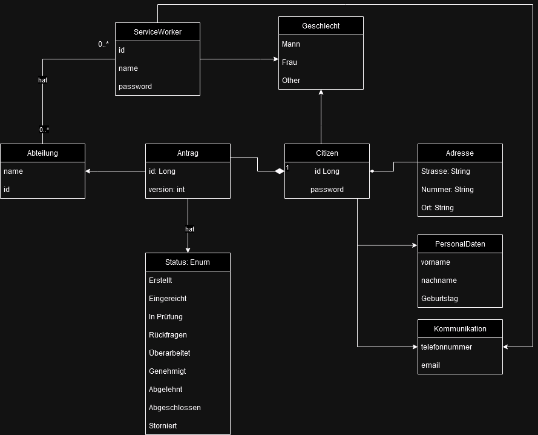

# Datenbankstruktur
Für de Umsetung des Projektes sollen verschieden Klassen genutzt werden. 
Wie dies miteinander in Beziehung stehen zeigt das folgende Bild.

Im laufe des Projekts kann sich diese Model noch ändern, jedoch bietet es bereits jetzt einen guten Überblick über alle 
Klassen.